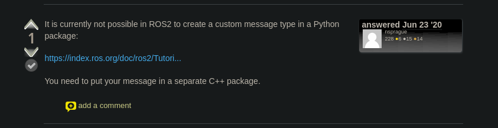

# Turtlesim-deque

CLI de controle do Turtlesim usando filas

Para rodar, clone o repositório, vá para a pasta `src` e use

```
python controller_node.py
```

e em outro terminal

```
python cli.py
```

Para visualizar o resultado no turtlesim, use

```
ros2 run turtlesim turtlesim_node
```

# Demonstração


https://github.com/Eduardo-Barreto/Turtlesim-deque/assets/34964398/c176eef3-27c3-40a3-94a5-7c3f2e5d3ed7


---

perdao a bagunça, fiquei boa parte do tempo tentando criar uma custom msg e só desisti qnd encontrei isso aqui faltando 30 min pra acabar o tempo da prova :p aí corri pra fazer o cli e acabei ficando com o String mesmo 😔


